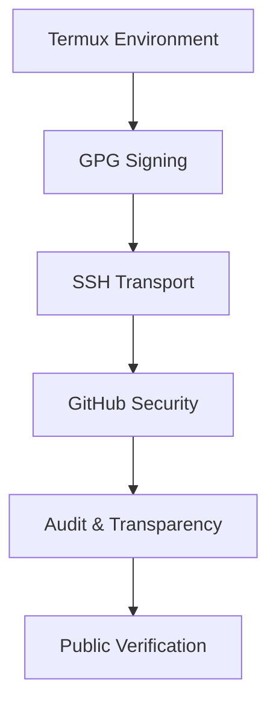

# OPENRESPUBLICA INFORMATION AND TECHNOLOGY SOLUTIONS (ORP)
---
### Developer: Marco Fernandez

**OpenResPublica is a transparency‑first initiative. Every commit is cryptographically signed, every push is securely transported, and every change is auditable. This README explains the trust pipeline and contributor requirements.**

---

## 🔐 Security & Transparency Overview

#### OpenResPublica is built on a sovereign trust pipeline: every commit is cryptographically signed, every push is securely transported, and every change is auditable.

## 🛡️ GPG (GNU Privacy Guard)
- **Purpose:** Ensures commit integrity and authenticity through digital signatures.
- **Functions:** Signing commits/tags, encrypting data, revoking compromised keys.
- **Secrets & Expiration:** Keys can be set to expire (e.g., 3 years) to enforce rotation and reduce risk.
- **Strength:** RSA 4096‑bit keys or ECC keys provide strong, long‑term security.
- **Impact:** Signed commits prevent tampering and impersonation, creating a verifiable audit trail.
- **Transparency:** GitHub shows a Verified badge on signed commits, visible to all contributors and auditors.

## 🔑 SSH (Secure Shell)
- **Purpose:** Provides secure, password‑less authentication for Git operations.
- **Functions:** Authentication, encryption of transport, agent forwarding.
- **Secrets:** Private keys are protected with passphrases; public keys are registered with GitHub.
- **Strength:** Ed25519 keys are modern, compact, and highly secure.
- **Impact:** Eliminates password theft risks, supports fine‑grained access control, and enforces separation of duties.

## 📱 Termux Environment
- **Background**: Termux is a Linux environment for Android, enabling full development and cryptographic workflows on mobile.
- **Security:** Runs in user space (no root required), with secrets stored in $HOME/.gnupg and $HOME/.ssh.
- **Tools:** Provides gnupg, git, openssh, and other packages for secure development.
- **Transparency:** Mobile devices become sovereign ledger appliances, capable of producing verifiable commits anywhere.

## 🌐 GitHub Modern Security
- **MFA (Multi‑Factor Authentication):** Adds strong account protection.
- **SSH & GPG keys:** Enforce cryptographic identity verification.
- **Fine‑grained tokens:** Scoped permissions for automation and CI/CD.
- **Notifications:** Real‑time alerts for pushes, PRs, and security events.
- **Collaboration:** Branch protections, PR reviews, and role‑based access enforce separation of duties.

## 📑 Dependencies & Tools
- **gnupg** → GPG key generation, signing, encryption.
- **git** → Version control, commit signing, pushing.
- **openssh** → SSH key generation and secure transport.
- **Termux packages** → Provide the Linux environment on Android.

## 🔍 Audit, Logging, Transparency
- **Every commit signed** → cryptographic audit trail.
- **GitHub Verified badges** → public transparency.
- **Logs in immudb and GitHub Actions** → tie operational events to signed commits.
- **Supports compliance** → verifiable history for regulators, auditors, and citizens.

## 🔐 Cryptographic Strength
- **RSA 4096‑bit (GPG)** → strong for long‑term signing.
- **Ed25519 (SSH)** → modern, efficient, and secure.
- **Combined** → ensures both data integrity (commits) and secure transport (pushes).

---

## 🔄 Trust Pipeline Diagram

## ✅ Contributor Requirements

**1. Clone via SSH**
   git clone git@github.com:openrespublica/openrespublica.github.io.git

**2. Configure GPG signing**
   Generate a key, add it to GitHub, and enable commit signing.

**3. Configure SSH authentication**
   Generate an ed25519 key, add it to GitHub, and switch your remote to SSH.

**4. Push signed commits**
   Every commit must be signed (git commit -S) and pushed via SSH.

---

## 📜 Summary

**OpenResPublica contributors operate in a trust‑first environment. Termux provides the mobile Linux base, GPG secures commit integrity, SSH secures transport, and GitHub enforces modern security practices. Together, these form a transparent, auditable, and cryptographically strong workflow that empowers citizens, auditors, and collaborators alike.**

---
